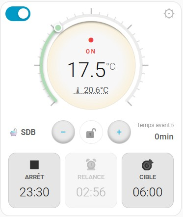
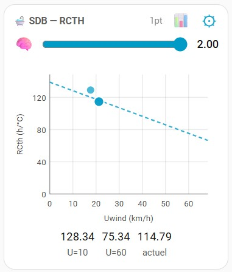

# SmartHRT Card


Une carte Lovelace personnalisée (Custom Card) pour Home Assistant, conçue spécifiquement pour piloter et monitorer l'intégration [SmartHRT](https://github.com/CorentinBarban/SmartHRT) (fork amélioré de mon script initial [SmartHRT](https://github.com/ebozonne/SmartHRT)).


## 📸 Captures d'écran

| Interface Principale | Mode Expert (Analyse RCth) |
| -------- | -------- |
|  |  |


## ✨ Fonctionnalités


* **Contrôle intuitif** : Interface tactile sous forme d'arc pour régler la température de consigne.

* **Verrouillage de sécurité** : Évite les mauvaises manipulations sur l'écran tactile.

* **Affichage des statuts** : Visualisation claire de l'état (chauffe, relance, lag, etc.) et du temps avant la prochaine relance.

* **Mode Expert intégré** : Génération native d'un graphique (scatter plot) pour analyser l'historique RCth et la vitesse du vent, directement sur la carte.

* **Mode sombre/clair** : Adaptation automatique au thème de votre tableau de bord Home Assistant.


## 📥 Installation via HACS


Cette carte est conçue pour être installée facilement via [](https://github.com/hacs/integration).


1\. Ouvrez HACS dans Home Assistant.

2\. Allez dans le menu en haut à droite (les trois petits points) et sélectionnez **Dépôts personnalisés** (*Custom repositories*).

3\. Ajoutez l'URL de ce dépôt : [https://github.com/ebozonne/smartHRT-card](https://github.com/ebozonne/smartHRT-card)

4\. Choisissez la catégorie **Lovelace** (ou Tableau de bord) et cliquez sur **Ajouter**.

5\. Cherchez "SmartHRT Card" dans HACS et cliquez sur **Télécharger**.

6\. Acceptez de recharger votre navigateur quand HACS vous le demande.


## ⚙️ Configuration (YAML)


Une fois installée, vous pouvez ajouter la carte à votre tableau de bord en utilisant l'éditeur manuel (YAML). 


Voici les paramètres disponibles :


```yaml

type: custom:smarthrt-card

prefix: salon      # REQUIS : le nom de l'instance SmartHRT (ex: salon, chambre)

name: Mon Salon    # OPTIONNEL : le titre affiché sur la carte (par défaut : le prefix avec une majuscule)

min_temp: 13       # OPTIONNEL : température minimale sur l'arc (défaut : 13)

max_temp: 26       # OPTIONNEL : température maximale sur l'arc (défaut : 26)

